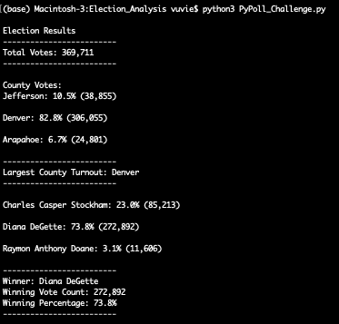

# Election Analysis

## Background
## Overview of Project
A Colorado Board of Elections employee assigned the following tasks to complete the election audit of a recent local congressional election.

1. Calculate the total number of votes cast.
1. Get a complete list of candidates who received votes.
1. Calculate the total number of votes for each candidate received.
1. Calculate the percentage of votes each candidate won.
1. Determine the winner of the election based on popular vote.
1. Calculate the voter turnout for each county.
1. Calculate the percentage of votes from each county out of the total.
1. Determine the county with the highest turnout.

### Resources
Data Source: election_results.csv
Software: Python 3.9.1, Atom 1.58.0 x 64

## Summary
* The analysis of the election shows that:
  * There were 369,711 votes cast in the election
* The candidates were:
  * Charles Casper Stockham
  * Diana DeGette
  * Raymon Anthony Doane
* The candidate results were:
  * Charles Casper Stockham received 23.0% of the vote, for a total of 85,213 votes.
  * Raymon Anthony Doane received 3.1% of the vote, for a total of 11,606 votes.
* The winner of the election was:
  * Diana DeGette received 73.8% of the vote, for a total of 272,892 votes.

## Challenge Overview

Include for these:

6. Calculate the voter turnout for each county.

7. Calculate the percentage of votes from each county out of the total.

8. Determine the county with the highest turnout.

## Challenge Summary

>Election Results



* The counties voting were:
 * Jefferson
 * Denver
 * Arapahoe
* The county results were:
  * Jefferson has 10.5% of voters, for a total voter turnout of 38,855.
  * Denver has 82.8% of voters, for a total voter turnout of 306,055.
  * Arapahoe has 6.7% of voters, for a total voter turnout of 24,801.
* The county with the highest turnout was:
  * Denver

### Election-Audit Summary

This script can be expanded to be used for voting results in:
* use as is for other counties besides just Colorado
* modified for precinct-level
* expanded for district-level, state-level and to even compute for presidential election results.

As as the dataset is from voting stations and consists of ballot ID, voter location, candidate voted; we can easily compute for all the different election levels as stated above as the data collected are the same.

We can even create a more granular view of the voting results by adding more conditions to find each candidate's highest voters county. By expanding ```candidate_votes``` to include ```county_name```, we will be able to count for candidate and their votes according to county.
This means we will know which gives highest votes for each candidate.

When we use this script to analyse past year's election performance, we will be able to view historical voting sentiments by knowing which county has higher voters turnout and whom they voted for. If we explore enough past years' dataset, we can most probably be able to see which party (candidate belongs to) has higher voters, where the voters are from and are they likely to vote (example, in this case, Denver has a very high voters turnout).

This can then determine the candidate's election rally and spending decisions to ensure the highest success rate of winning the election.

This script can also be used for any countries and their different election levels to quickly get their election results.

**NOTE**: The results are saved in ```election_analysis.txt``` and not ```election_results.txt```.


------------------

## Appendix
The following is writing method using the Analytics Paradigm

### Purpose
see  [Background --> Overview of Project](#background)
## Methodology: Analytics Paradigm

#### 1. Decomposing the Ask
Using election results dataset to determine the 8 questions asked above in [Background --> Overview of Project](#background)

#### 2. Identify the Datasource
election_results.csv

#### 3. Define Strategy & Metrics
Using Python to read, compute and format output of the requirements into a txt file.

#### 4. Data Retrieval Plan
Use election_results.csv in Python with ```import csv``` and ```file_to_load = os.path.join("resources", "election_results.csv")```

#### 5. Assemble & Clean the Data
Python scripting

#### 6. Analyse for Trends
8 questions asked above in [Background --> Overview of Project](#background)

#### 7. Acknowledging Limitations
* Limitation of personal knowledge in Python programming
* Using Python, the scripts will run in real-time.

#### 8. Making the Call:
The "Proper" Conclusion is indicated below on [Results](#results)

## Analysis
See in [Summary](#summary).

## Results
See in [Challenge Summary](#challenge-summary).

------------------
